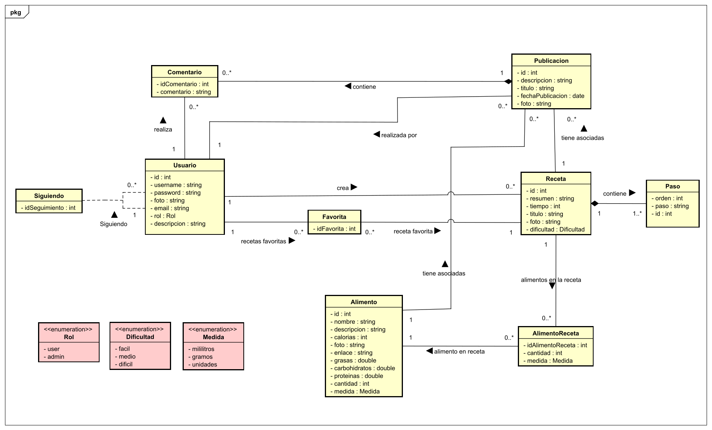
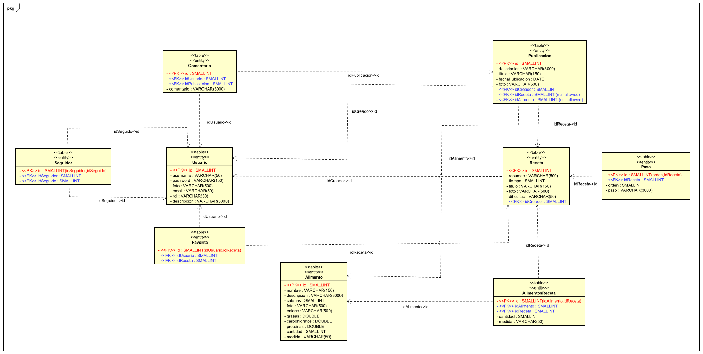

<h1>Documento resumen del proyecto para crear la aplicación "FoodBook"</h1>

<ol>
<h2><li>Resumen del proyecto</li></h2>

Esta aplicación se ha desarrollado en el Trabajo de Fin de Grado para el Grado en Ingeniería Informática en la mención de Ingeniería de Software de la Escuela de Ingeniería Informática de la Universidad de Valladolid. La documentación de este proyecto se encuentra en el PDF adjunto TFG-Jose-Maria-Lozano-Olmedo. Este documento de resumen solo comenta los aspectos más importantes sobre la documentación completa. Posteriormente a la entrega y defensa de este trabajo, se han realizado las mejoras propuestas por el tribunal de evaluación. Este trabajo obtuvo una calificación de 9,4.

Esta aplicación servirá para que los usuarios compartan sus experiencias en la cocina. De manera que funcionará como una red social donde los usuarios podrán publicar las experiencias que tengan con una determinada receta, compartir recetas personales para que los demás usuarios las puedan ver y realizar publicaciones a partir de ellas. Además, los usuarios podrán publicar sus experiencias sobre diversos alimentos de manera que puedan ayudar a otros usuarios para su consumo. También los usuarios verán las publicaciones de la gente que siguen y podrán guardar sus recetas favoritas para que puedan acceder a ellas rápidamente. 

<h2><li>Aplicaciones similares</li></h2>

Se han encontrado varias aplicaciones similares que pueden servir de referencia:

<ul>
<li>Instagram y Youtube</li>
<li>Yelp</li>
<li>"Recetas de rechupete" y "Directo al paladar"</li>
</ul>

<h2><li>Tecnologías utilizadas</li></h2>

Se van a utilizar las siguientes tecnologías para el desarrollo de la aplicación:

<ul>
<li>Frontend: Angular y Bootstrap</li>
<li>Backend: NodeJS y ExpressJS</li>
<li>Base de datos: MySQL</li>
</ul>

<h2><li>Funcionalidad de la aplicación. Casos de uso</li></h2>

A continuación se expone el diagrama de casos de uso de la aplicación:

<h2><li>Diagrama de clases</li></h2>

A continuacion se expone el diagrama de clases de la aplicación:

<h2><li>Estructura de la base de datos</li></h2>

A continuación se expone el diagrama con las relaciones entre las tablas de la base de datos de la aplicación:

<h2><li>Estructura del backend</li></h2>

La estructura del backend va a consistir en una API REST en NodeJS creada con la ayuda de ExpressJS de manera que el frontend haga las peticiones al backend con las operaciones que quiere realizar sobre la base de datos. Existe un fichero que controla estas peticiones y dependiendo la petición que sea, llama al archivo Javascript correspondiente que realice la acción deseada.
Este fichero es el controlador y dependiendo de la ruta que se solicite llamará uno de los DAO correspondiente en la carpeta DAO. Cada DAO agrupa las operaciones sobre una determinada tabla de la base de datos. 

<h2><li>Arquitectura lógica del sistema</li></h2>
Se ha utilizado una arquitectura cliente-servidor de tres capas para este sistema. Este estilo arquitectónico está compuesto por una capa de presentación, una capa lógica y una capa de datos. La capa lógica consiste en un servidor que proporciona unos recursos y servicios que son consumidos por la capa de presentación. La capa de presentación es el cliente que se encarga de representar los datos que obtiene del servidor. El cliente se comunica con el servidor mediante peticiones HTTP que definen las acciones que el cliente quiere realizar. El servidor realiza esas acciones sobre la capa de datos que es la base de datos y envía al cliente una respuesta. En el siguiente diagrama se puede ver la arquitectura lógica del sistema.

<h2><li>Bocetos del frontend</li></h2>
Se han realizado bocetos con Balsamiq con la idea básica de como será la aplicación. Estos bocetos han servido de guía para el desarrollo de la aplicación, sin embargo durante el desarrollo se han encontrado mejoras sobre estos bocetos. Por lo tanto el resultado final, combina los bocetos con ideas aparecidas durante el desarrollo. Los bocetos se encuentran en el pdf adjunto bocetos-foodbook.

<h2><li>Detalles de la aplicacion</li></h2>
<ul>

<li>Colores:
<ul>
<li>Verde claro:#00b347</li>
<li>Verde oscuro:#AB1739</li>
</ul>
</li>
<li>
Icono:

</li>
</ul>
<h2><li>Planificacion del proyecto</li></h2>

Se ha aplicado Scrum para el desarrollo y planificación del proyecto. La carga de trabajo se ha dividido en 8 sprints con una duración de dos semanas y media. En esta carga de trabajo se incluyen tanto el tiempo dedicado a la creción de la aplicación como el tiempo dedicado a la realización de la documentación. Finalmente en la última fila de la tabla se ve el tiempo dedicado para el sprint adicional posterior a la entrega en el que se han aplicado las mejoras sugeridas por el tribunal. En la siguiente tabla se muestra la planificación de los sprints del proyecto. 

<strong>Tiempo empleado: 308 horas</strong>

<h2><li>Resultado final: vídeo youtube y repositorio</li></h2>
Repositorio Github: https://github.com/chemiya/PR-14-TFG

Video Youtube: https://www.youtube.com/watch?v=kM_FTeL3CQ0

<h2><li>Conclusiones</li></h2>
He desarrollado una aplicación web para mi Trabajo de Fin de Grado que puede tener una gran utilidad en la sociedad actual y puede ayudar a organizar todo el contenido relacionado con la alimentación. He seguido ampliando mis conocimientos sobre Angular, NodeJS y MySQL. He podido aplicar los conocimientos aprendidos durante los cuatro de la universidad, en especial, aplicando los conocimientos aprendidos sobre Ingeniería de Software.

</ol>
